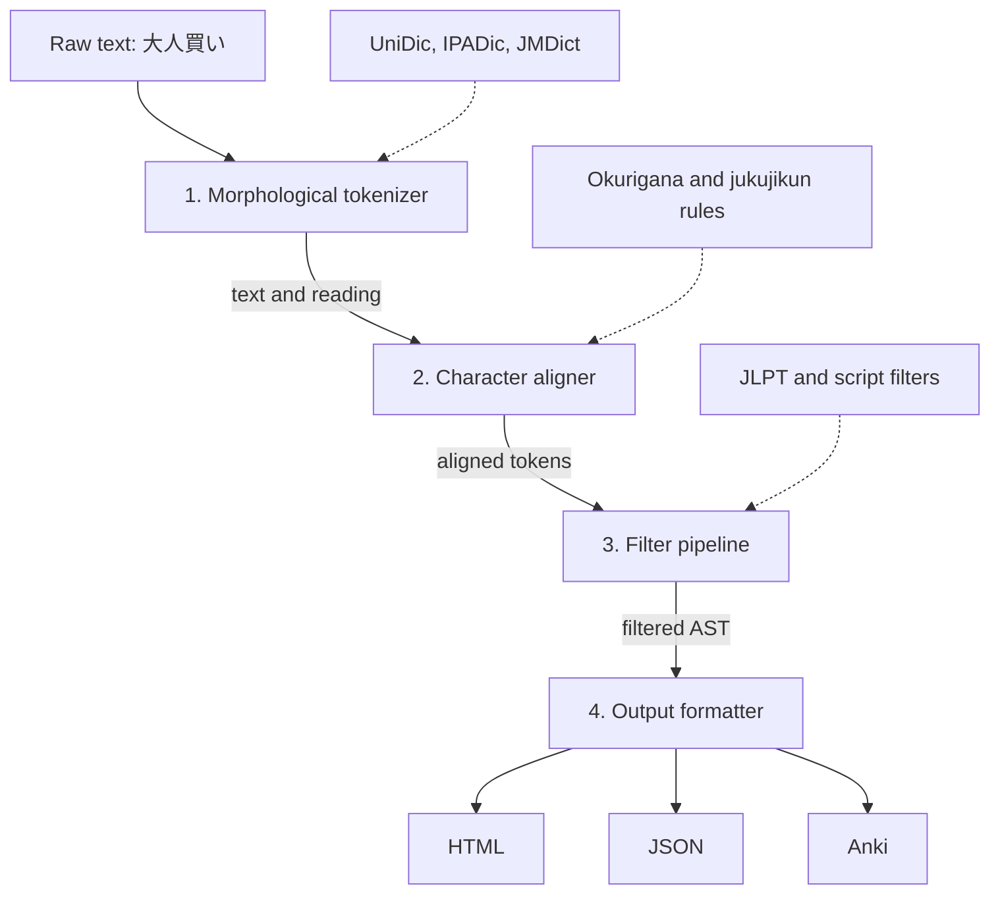
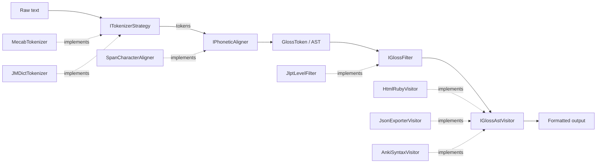

# Diagrams

## 1. High-Level Pipeline Flowchart

This **Flowchart Diagram** illustrates the high-level data transformation pipeline.

## 2. Detailed Strategy & Visitor Class Diagram

This **Architecture / Class Structure Diagram** shows how the decoupled design patterns (Strategy, Factory, Visitor) map to these stages.

